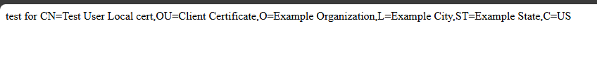

1. run create-certs.sh (at least initially with createCA=1 in ~line 6)
2. install certs according to the end of the script
3. setup nginx according to nginx.conf

4. opening https://localhost in browser should show client selection popup and then look like 

